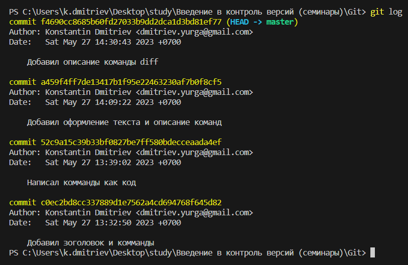

# Основные команды 1-го семинара #
## Первоначальные настройк Git ##
Что бы задать имя пользователя ввести команду:

        git config --global user.name "User Name"
User Name имя пользователя которое вы задаете

Что бы посмотреть имя пользователя ввести:

        git config --global user.name  

Что бы задать email пользователя введите команду:  
 
        git config --global user.email user.name@gmail.com  

Что бы посмотреть email пользователя ввести:

        git config --global user.name  

## Комманды Git ##
После открытия каталога с проектом его необходима инициализировать, для этого нужно ввести команду:

        git init  

Что бы посмотреть состояние рабочего каталога ввести команду:

        git status  

Для перед добавление коммита нужно доавить файл в индекс, предворительно сохранив редактируемый файл. Комманда для добавления редактируемого файла в индекс:

        git add 'name.txt' 

Для добавления всех файлов рабочего каталого в индекс выполнить команду:

        git add . 

Для того что бы записать проиндексированные измения в репозиторий выполнить команду:

        git commit -m 'комменарий'  

Для просмотра списка изменений после последней команды `commit` ввести команду:

        git diff

Для того что бы вывести список коммитов необходимо выполнить команду:

        git log

Результа выполнения команды `git log` комманды:

Для того что бы перейти к какому то коммиту нужно ввести комманду `checkout` с указанием первых четырех символов метки коммита. Например:

        git checkout 52c9

В результате в редакторе отобразится файл с актуальностью на момент сохранного коммита кторый мы выбрали.

Для возврата в исходный файл необходимо ввести команду:

        git checkout master

